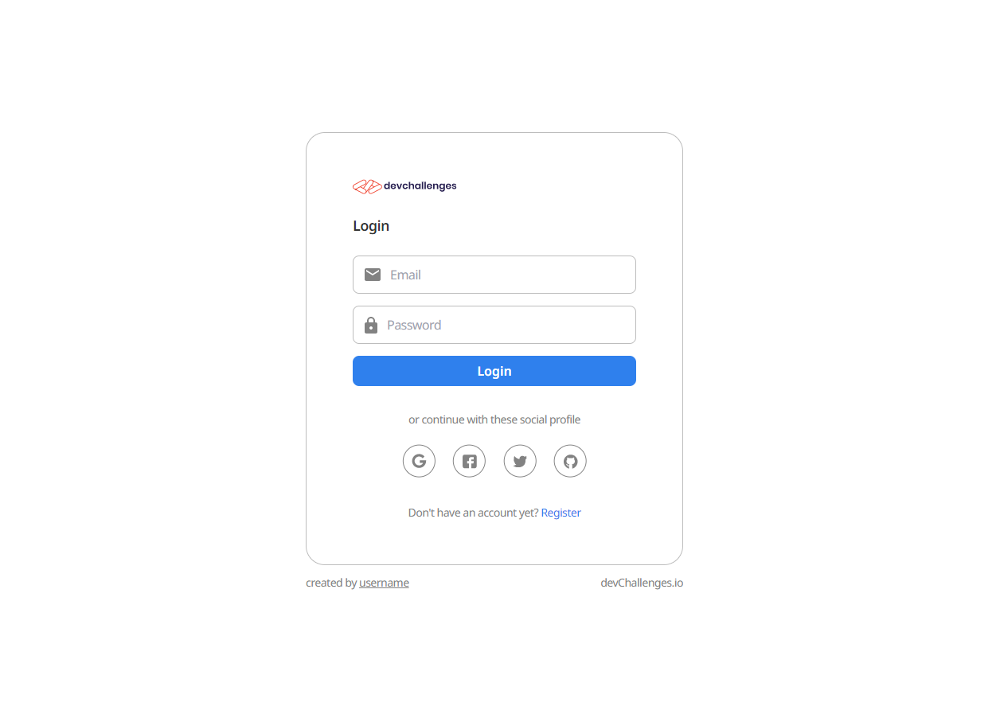

<!-- Please update value in the {}  -->

<h1 align="center">Daba Test Project</h1>

<div align="center">
   Solution for a challenge from  <a href="https://investondaba.notion.site/Fullstack-Intermediate-Test-2-c911eab2a18446d4a87eb5ca938f13ad" target="_blank">daba full stack intermediate coding exercise</a>.
</div>

<div align="center">
  <h3>
    <a href="https://daba-test.netlify.app/" target="_blank">
      Demo
    </a>
    <span> | </span>
    <a href="https://daba-test.netlify.app/" target="_blank">
      Solution
    </a>
    <span> | </span>
    <a href="https://investondaba.notion.site/Fullstack-Intermediate-Test-2-c911eab2a18446d4a87eb5ca938f13ad">
      Exercise
    </a>
  </h3>
</div>

<!-- TABLE OF CONTENTS -->

## Table of Contents

- [Overview](#overview)
  - [Built With](#built-with)
- [Features](#features)
- [How to use](#how-to-use)
- [Contact](#contact)
- [Acknowledgements](#acknowledgements)

<!-- OVERVIEW -->

## Overview



This was a very interesting challenge. I have not used GraphQL for a while and it was great to get back to it. 
The Frontend is hosted on Netlify while the Backend is hosted on Render

- [Demo](https://daba-test.netlify.app/)
- [API URL](https://daba-api.onrender.com/)

Links to video explanations:

- [Video Explanation 1](https://www.loom.com/share/c3072faae9654e3b92b915f1598963b8)
- [Video Explanation 2](https://www.loom.com/share/467e4995e99a4c3a9cfd8d6f630fb05d)
- [Video Explanation 3](https://www.loom.com/share/1e236c8a3ed94afaa57e8bba32d9f14e)

### Built With

<!-- This section should list any major frameworks that you built your project using. Here are a few examples.-->

- [React](https://reactjs.org/)
- [Tailwind](https://tailwindcss.com/)
- Styled Components
- NodeJS
- GraphQL
- MongoDB

## Features

<!-- List the features of your application or follow the template. Don't share the figma file here :) -->
- Sign Up
- Sign In
- View Profile details
- Change Profile details

## How To Use

<!-- Example: -->

To clone and run this application, you'll need [Git](https://git-scm.com) and [Node.js](https://nodejs.org/en/download/) (which comes with [npm](http://npmjs.com)) installed on your computer. From your command line:

```bash
# Clone this repository
$ git clone https://github.com/kibuikaCodes/daba-test

# cd into each directory independently
# for the api
$ cd api && npm install && npm start

# open another terminal for the UI
$ cd ui && npm install && npm start
```

You will also need to provide environment variables for bot the UI an the API

for the UI, you will need to provide: 
```bash
REACT_APP_API_URL="http://localhost:5000" # for the local api
# the url of the hosted api is => https://daba-api.onrender.com/
```

for the API
```bash
PORT=5000
MONGOURI="" # your own MongoDB access uri
JWT_SECRET=YOUR_JWT_SECRET
JWT_EXPIRES_IN="30 days"
```

## Contact
kibuikasteve@gmail.com


### Happy Hacking!!